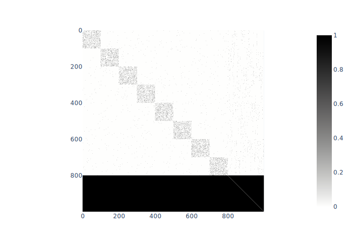
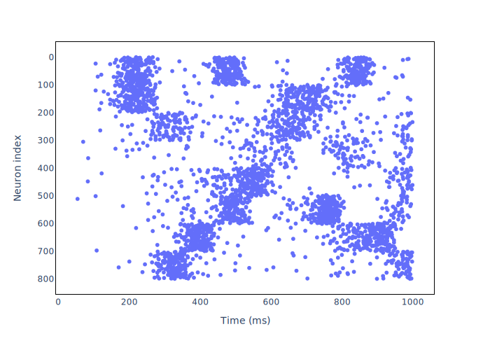
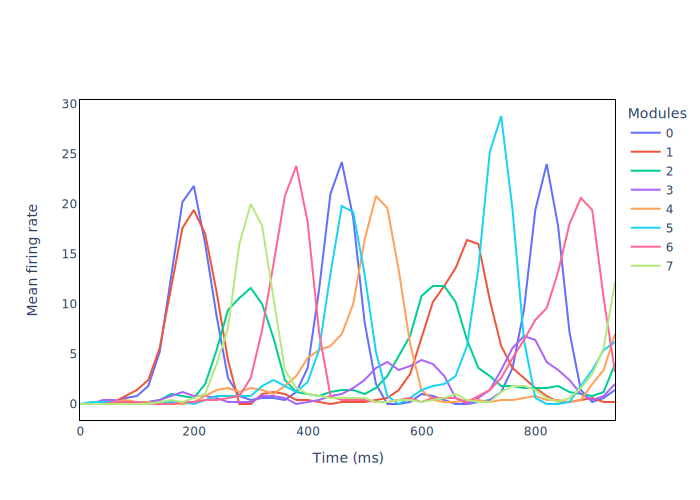

# Izhikevich Neurons
Exploring dynamical complexity in a small-world modular network of Izhikevich neurons.

## What are Izhikevich neurons?

In a nutshell, an Izhikevich neuron is a mathematical model of a spiking neuron. It reproduces the spiking and bursting behavior of known types of cortical neurons. 
Here's the paper presenting the model: [Izhikevich neuron paper](https://ieeexplore.ieee.org/abstract/document/1257420?casa_token=E6UNE8inLvEAAAAA:H1dYISFUxNJGTGAiAYoqY0yF3WWn9E5cfkeAM2A0HSXoFghrDai76P6K4uWVYJ3xkWTmIEwB)

## Visualizing results

Below are the results obtained when the rewiring probability *p* is set to 0.1.

### Matrix connectivity
In the connectivity matrix, the first 800 neurons are excitatory, and the last 200 neurons are inhibitory. The
bottom black rectangle in the matrix connectivity shows that inhibitory neurons are connected to all other neurons
(except self-connections).



### Raster plots of neuron firing in a 1000ms run



### Mean firing rate in each of the eight modules for a 1000ms run



## Usage 

### Initial Setup

To run the code and reproduce the results, follow the following steps:

1. Clone the Repository

   ```git clone https://github.com/HelenaFP/izhikevich_neurons.git```
   

3. Create a virtual environment:
  
    ```
    python3 -m venv venv
    source venv/bin/activate
    ```

4. Install Required Packages:
  
    ```
    pip install -r requirements.txt
    ```

### Run the code to reproduce results

To reproduce results, run:

```
python swnetwork.py
```

Once this is done, your plots will be available on the ```plots/``` folder.


## Explanation of  SWMNetwork class

This class is defined in ```swmnetwork.py```.


| Function name                    | Function                                        |
|-------------------------------|--------------------------------------------------------------------------|
| create network()             | This function creates a small-world modular network of Izhikevich neurons and configures its parameters, including weights, delays, and neuron-specific parameters. It returns a configured IzNetwork object that can be used for simulations and further analysis.     |
| run simulation()    | This function conducts a simulation of the configured network over a specified duration. It stores neurons’ membrane potentials at each timestep.|
| compute mean firing rates()          | This function computes the mean firing rates in each of the eight modules of the network during a 1000ms simulation run. The firing rates are calculated by computing the average number of firings in 50ms windows shifted every 20ms.             |
| plot connectivity()           | Generates a plot of the matrix connectivity|
| plot raster()              | Generates a raster plot of the neuron firing in a 1000ms run.                   |
| plot firing rate()                 | Generates a plot of the mean firing rate in each of the eight modules for a 1000ms run.     |


## Code

💻  [SWMNetwork](https://github.com/HelenaFP/izhikevich_neurons/blob/main/swnetwork.py)<br/>
